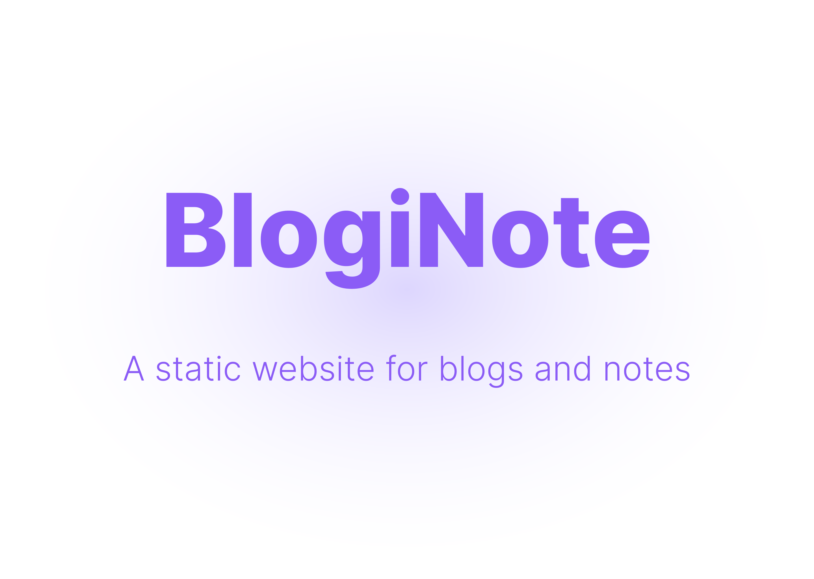

# BlogiNote
BlogiNote is a [Nuxt Theme](https://nuxt.com/docs/guide/going-further/layers) based on [Nuxt Content module](https://content.nuxtjs.org/), it can generate static website to show your blog posts and notes with flexible layouts and multiple optimizations.

:link: [Demo](https://bloginote.benbinbin.com/)

:joystick: [Play Online](https://stackblitz.com/edit/github-qrmhoj)

:pencil: [Starter Template](https://github.com/Benbinbin/BlogiNote-Starter-Template)

:bookmark_tabs: [Documentation](https://documentation.bloginote.benbinbin.com/)

## Features
:sparkles: Content driving: generate web pages based on markdown, json, csv and more

:sparkles: Vue components in Markdown: with [MDC syntax](https://content.nuxtjs.org/guide/writing/mdc) you can use vue components inside markdown file

:sparkles: List Page: a list page make the filter and query articles more convenient

:sparkles: Full text search: you can search content everywhere powered by [Pagefind](https://pagefind.app/) 🎥 [Demo](https://youtu.be/OotBwk88Y38)

:sparkles: Tree Catalog: you can catch the outline of the article easily with a Mind Map powered by [D3.js](https://d3js.org/) 🎥 [Demo](https://youtu.be/dxR8Oh0a4E4)

:sparkles: Toggle Heading: you can toggle the heading to show or hide the following content, it's so useful to read a long long post 🎥 [Demo1](https://youtu.be/2OVF7ZLpopE) [Demo2](https://youtu.be/U8ylBVHekRM)

:muscle: it will keep evolving to add more features

🎥 More demo please checkout the [Youtube playlist](https://youtube.com/playlist?list=PLqLRbo_6ezAEpy7KjFbXTgjndhJr0M5Zj)

## Usage
Use the [starter template](https://github.com/Benbinbin/BlogiNote-Starter-Template) to build your own project with the BlogiNote theme.

:point_right: You can check out [this tutorial](https://documentation.bloginote.benbinbin.com/article/tutorial/get-start) for more information.

## Develop
You can also build your own template based on BlogiNote, adding some Remark plugins to extend the markdown syntax, or building some Vue components to add more custom features.

## License

[MIT](./LICENSE)

## Feedback
If you have any problem or suggestion about this project, feel free to open an [issue](https://github.com/Benbinbin/BlogiNote/issues/new) in Github or contact with me by email <a href="mailto:benthomsonbin@gmail.com">benthomsonbin@gmail.com</a>