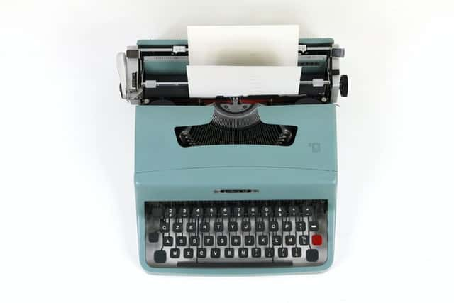
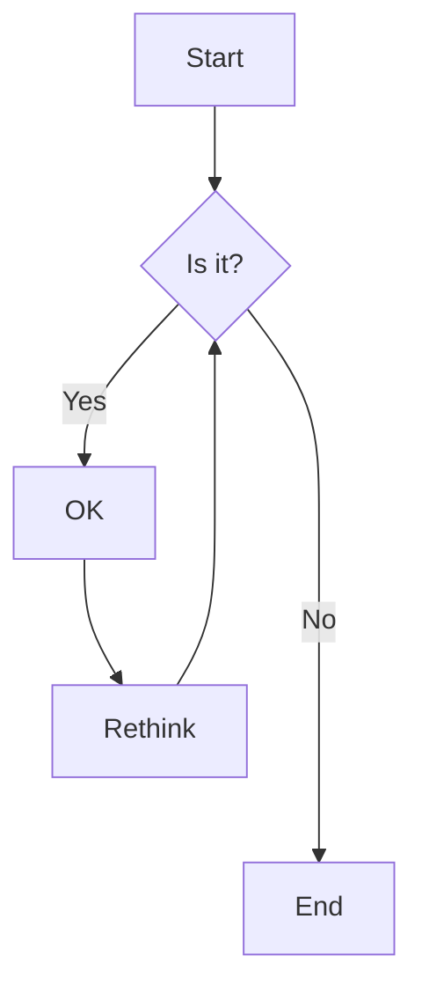

# Example Article

Markdown is a lightweight markup language, you can add some marks to plain text and convert them to rich and more semantics content.

you can write it by using any text editor, with some simple marks to format the content, like adding `#` symbol before some content separating with spacing, then these content will mark as Heading1 (Markdown supports mark content as 6 different levels). Markdown file extension is `.md`

## Basic Syntax

::TipBox{type="tip"}
Markdown basic syntax can refer to the following two websites:

* [CommonMark](https://commonmark.org/)

* [GitHub Flavored Markdown Spec (gfm)](https://github.github.com/gfm/)
::

### Text Style

**Italic**

**Bold**

~~delete~~ ~del~

### Link

[Google](https://www.google.com/)

### Image




::TipBox{type="tip"}
you can double click the image to zoom in
::

### Blockquote

> Blockquote content

### List

#### Unordered List

* list item one
  * nest list item 1
  * nest list item 2
  * nest list item 3
    * deep nest list item a
    * deep nest list item b
    * deep nest list item c
* list item two
* list item three

#### Ordered List

1. list item one
    1. nest list item 1
    2. nest list item 2
    3. nest list item 3
2. list item two
3. list item three


### Code

inline code `npm install marked`

block code

```javascript
console.log('hello world!')
```

block code with some rows highlighted and specify the source file of the code

```javascript [/components/content/ProseCode.vue] {2-4, 6}
const languageColorMap = {
  theme: '#a855f7',
  bash: '#89e051',
  shell: '#89e051',
  html: '#e34c26',
  javascript: '#f1e05a',
}
```

### table

| First Header | Second Header | three Header | forth Header | fifth Header | sixth Header |
| :---: | :---: | :---: | :---: | :---: | :---: |
| Content Cell | Content Cell | Content Cell | Content Cell | Content Cell | Content Cell |
| Content Cell | Content Cell | Content Cell | Content Cell | Content Cell | Content Cell |
| Content Cell | Content Cell | Content Cell | Content Cell | Content Cell | Content Cell |
| Content Cell | Content Cell | Content Cell | Content Cell | Content Cell | Content Cell |

### Footnote

Here's a first footnote[^1] and here's the second number footnote[^2].

### Other

Dividing lines

---

### Emoji

[emoji](https://www.webfx.com/tools/emoji-cheat-sheet/) :smile: :bulb: :warning:

## Extended syntax

### Mermaid



### Math Formula
inline math formula $E=mc^2$

block math formula

$$
\begin{aligned}
P \times A
&=
\begin{bmatrix}
  0& 1\\
  1& 0
\end{bmatrix}
\begin{bmatrix}
  a& b\\
  c& d
\end{bmatrix}
&=
\begin{bmatrix}
  c&d \\
  a&b
\end{bmatrix}
\end{aligned}
$$

::TipBox{type="tip"}
double click the formula can copy the corresponding LaTeX code to clipboard

you can check the [KaTeX documentation](https://katex.org/docs/supported.html) to see which math symbols are supported
::

### Text Style

Superscript x^2^

Subscript O_2_

++addition++

--delete--

//comment//

==highlight==

### Images Group

images group (contain one piece)

::ImageList{height='400px'}

::

images group (contain many pieces)

::ImageList{height='500px'}


::

::TipBox{type="tip"}
you can also double click the image to zoom in
::

### Tab Group

::TabGroup
  ::TabItem{name="Tab1"}
  this is the first tab
  ::

  ::TabItem{name="Tab1"}
  this is the second tab
  ::

  ::TabItem{name="Tab3"}
  this is the third tab
  ::
::

---

[^1]: This is the first number footnote.
[^2]: This is the first number footnote.
