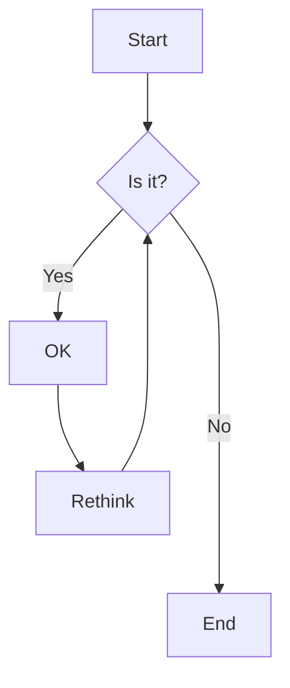

# 文章示例

Markdown 是一种「轻量级」的标记语言，为纯文本添加一些标记就可以将它们转换为更具语义化的富文本。

你可以使用普通的文本编辑器来编写这种标记语言，通过简单的标记语法可以使普通文本内容具有一定的格式，例如通过在一段文字前添加 `#` 并以空格间隔，就可以将该段文字**标记**为一级标题（Markdown 支持标记共六个等级的标题）。Markdown 文件的后缀名是 `.md`

## 基础语法

::TipBox{type="Tip"}
Markdown 的详细语法可以参考以下两个网站：

* [CommonMark](https://commonmark.org/)

* [GitHub Flavored Markdown Spec (gfm)](https://github.github.com/gfm/)
::

### 字体样式

*斜体字*

**粗体**

~~删除线~~ ~删除~

### 链接

[Bing](https://www.bing.com/)

### 图片


::TipBox{type="tip"}
你可以双击图片将其放大
::

### 引用

> 引用文本

### 列表

#### 无序列表

* 列表项一
  * 嵌套列表项 1
  * 嵌套列表项 2
  * 嵌套列表项 3
    * 深度嵌套列表项 a
    * 深度嵌套列表项 b
    * 深度嵌套列表项 c
* 列表项二
* 列表项三

#### 有序列表

1. 列表项一
    1. 内嵌列表项 1
    2. 内嵌列表项 2
    3. 内嵌列表项 3
2. 列表项二
3. 列表项三


### 代码

行内代码 `npm install marked`

代码块

```javascript
console.log('您好!')
```

代码块，高亮部分行，标注文件的来源

```javascript [/components/content/ProseCode.vue] {2-4, 6}
const languageColorMap = {
  theme: '#a855f7',
  bash: '#89e051',
  shell: '#89e051',
  html: '#e34c26',
  javascript: '#f1e05a',
}
```

### 表格

| 第一列表头 | 第二列表头 | 第三列表头 | 第四列表头 | 第五列表头 | 第六列表头 |
| :---: | :---: | :---: | :---: | :---: | :---: |
| 单元格 | 单元格 | 单元格 | 单元格 | 单元格 | 单元格 |
| 单元格 | 单元格 | 单元格 | 单元格 | 单元格 | 单元格 |
| 单元格 | 单元格 | 单元格 | 单元格 | 单元格 | 单元格 |
| 单元格 | 单元格 | 单元格 | 单元格 | 单元格 | 单元格 |

### 脚注

这是第一个脚注[^1]这是第二个脚注[^2].

### 其他

分割线

---

### 表情符号

[emoji](https://www.webfx.com/tools/emoji-cheat-sheet/) :smile: :bulb: :warning:

## 拓展语法

### 图表



### 数学公式
行内的公式 $E=mc^2$

公式块

$$
\begin{aligned}
P \times A
&=
\begin{bmatrix}
  0& 1\\
  1& 0
\end{bmatrix}
\begin{bmatrix}
  a& b\\
  c& d
\end{bmatrix}
&=
\begin{bmatrix}
  c&d \\
  a&b
\end{bmatrix}
\end{aligned}
$$

::TipBox{type="tip"}
双击公式可以将相应的 LaTeX 代码复制到剪切板

可以浏览 [KaTeX 的官方文档](https://katex.org/docs/supported.html)查看目前哪些公式符号是支持的
::

### 字体样式

上标 x^2^

下标 O_2_

### 图片组

图片组

::ImageList{height='500px'}


::

::TipBox{type="tip"}
你也可以双击图片将其放大
::

### 标签组

::TabGroup
::::TabItem{name="标签组1"}
这是第一个标签组 :thumbsup:
::::

::::TabItem{name="标签组2"}
这是第二个标签组 :wink:
::::

::::TabItem{name="标签组3"}
这是第三个标签组 :tada:
::::
::

---

[^1]: 这是第一个脚注的内容。
[^2]: 这是第二个脚注的内容。
