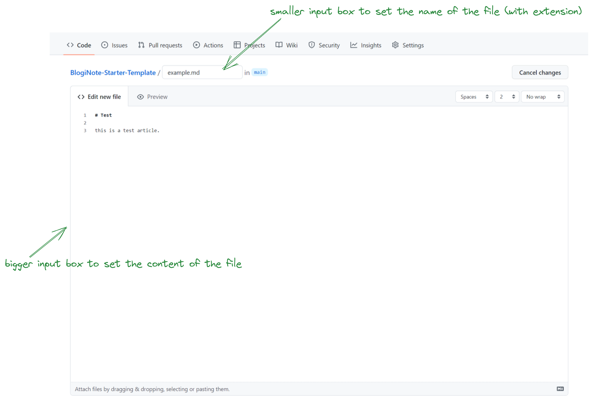
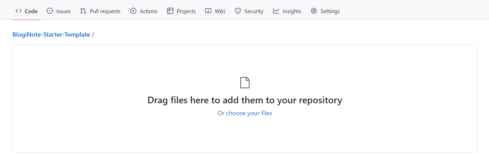
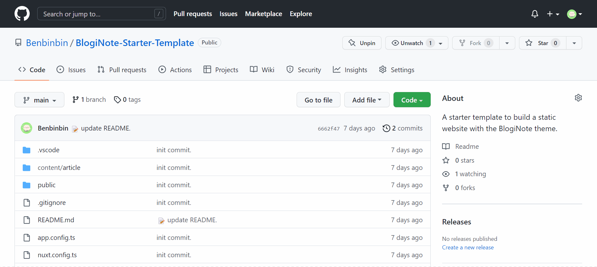
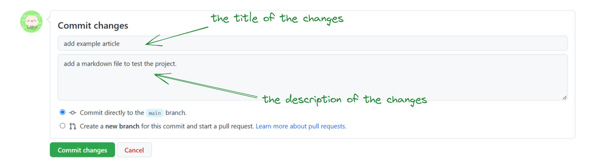

# Get Start

This tutorial will show your how to setup a project with BlogiNote step-by-step.

:IconCustom{name="ph:lightning-fill" iconClass="text-yellow-400"} Let's Go :IconCustom{name="ph:lightning-fill" iconClass="text-yellow-400"}

## Setup Environment (Optional)

::TipBox{type="announce" name="Optional Step"}
The steps in this part is **optional**.

If you just need to write the markdown files locally (then upload to the remote repository at Github), you can **skip** this section.

If you wants to test or preview the web pages generated from markdown files locally, you should follow these steps.
::

1. Install the Node.js first:

    you can download the latest LTS Version Node.js installer from the Node.js [Homepage](https://nodejs.org/en/download/) (please select the suitable installer for your computer system) and install it.

    ::TipBox{type="good" name="Recommend"}
    A better way for developer to install the Node.js is using **[nvm](https://github.com/nvm-sh/nvm)**.

    nvm can manage multiple Node.js versions and change the active version easily.

    nvm is just for UNIX, Mac and Windows WSL. You can try the **[nvm-windows](https://github.com/coreybutler/nvm-windows)** for Windows.
    ::

2. Then run the follow command at terminal to install the [`yarn` package](https://yarnpkg.com/) globally:

    ```bash
    npm i yarn
    ```

3. Install [Git](https://git-scm.com/downloads):

    Git is a free and open source version control system, we will use it to control the version of blog posts content, and sync the content between local project and remove repository at Github.

    ::TipBox{type="tip" name="Version Control"}
    Version Control is a software engineering concept.

    In the lifetime of a software, the code will change many times.

    After added new features or fixed bugs, developers will release the new version to mark the changes.
    ::

4. Install [Visual Studio Code](https://code.visualstudio.com/):

    Visual Studio Code is an open source editor, it provide many useful features and plugins for developer.

    ::TipBox{type="tip"}
    If you just want to write some markdown files (as blog posts), and don't need to code for adding the custom features, you can install any [Markdown Editor](https://github.com/mundimark/awesome-markdown-editors) as you like.

    :sparkles: If you don't want to install any extra editor on your local PC, you can try this [StackBlitz](https://stackblitz.com/edit/github-qrmhoj) project.

    This is an free online coding environment running the BlogiNote, it works right out of box :sunglasses: you create any new markdown files as you want, then the preview window on the right side will update simultaneously.
    ::

## Register Github and Vercel Account

1. Register a [Github](https://github.com/) account first:

    ::TipBox{type="tip"}
    Github is an online hosting service for code.

    The [source code of BlogiNote](https://github.com/Benbinbin/BlogiNote) is also hosted by it.
    ::

    You need to register an account of Github, because the next step is to copy the starter template from it.

    :IconCustom{name="noto:money-bag" iconClass="w-6 h-6"} the quota of the Github [Free Plan](https://github.com/settings/billing/plans) is enough for this project.

2. Then register a [Vercel](https://vercel.com) account:

    We need to deploy our static website to this platform.

    :IconCustom{name="noto:money-bag" iconClass="w-6 h-6"} the quota of the Vercel [Free/Hobby Plan](https://vercel.com/pricing) is fine for this project. If your website need more bandwidth, you can upgrade the plan at any time.

    ::TipBox{type="good" name="Recommend"}
    The more convenient way is to **Login** Vercel with the [:IconCustom{name="octicon:mark-github-16" iconClass="w-4 h-4"} Continue with Github]{.w-fit .px-4 .py-1 .inline-flex .items-center .gap-2 .text-sm .text-white .font-bold .bg-gray-800 .hover:bg-gray-600 .rounded .transition-colors .duration-300 .cursor-pointer} option.
    ::
## Use the Starter Template
The most easy way to build your own project is using the starter template of BlogiNote.

::TipBox{type="warning"}
You should have a Github account and login before the next step.

Please check out the previous section *[Register Github and Vercel Account](#register-github-and-vercel-account)* about how to register a Github account.
::

### Fork Template
Open [this website](https://github.com/Benbinbin/BlogiNote-Starter-Template) and click the [:IconCustom{name="octicon:repo-forked-24" iconClass="w-4 h-4"} Fork]{.w-fit .px-2 .py-1 .inline-flex .items-center .gap-2 .text-xs .text-gray-600 .hover:bg-gray-100 .border .border-gray-300 .rounded .transition-colors .duration-300 .cursor-pointer} button at the top-right corner of the page.

Then you will create a copy of the repository under your Github account.

Now you have full control over this duplicated repository, for example you can click the [:IconCustom{name="octicon:settings-24" iconClass="w-4 h-4"} Settings]{.w-fit .px-2 .py-1 .inline-flex .items-center .gap-2 .text-xs .text-gray-600 .hover:bg-gray-100 .border .border-gray-300 .rounded .transition-colors .duration-300 .cursor-pointer} tab, and rename your repository in the `Repository name` input box.

### Download Template (Optional)

::TipBox{type="announce" name="Optional Step"}
The steps in this part is **optional**.

If you just need to write the markdown files, then upload to the remote repository at Github, you can **skip** this section.

If you wants to test or preview the web pages generated from markdown files locally, you should follow these steps.
::

After fork the template, you can click the [Code :IconCustom{name="material-symbols:arrow-drop-down" iconClass="w-4 h-4"}]{.w-fit .px-2.5 .py-1.5 .inline-flex .items-center .gap-2 .text-sm .text-white .font-bold .bg-green-500 .hover:bg-green-600 .rounded .transition-colors .duration-300 .cursor-pointer} button at the repository (under your Github account) page.

Then you will see a pop-up menu with some options to Clone/Download the code to your local PC.

* You can use command to download the code:

  the pop-up menu first option show multiple tabs, under the **`HTTPS` tab** there is a link, click the [:IconCustom{name="octicon:copy-24" iconClass="w-4 h-4"}]{.p-1 .text-xs .text-gray-600 .hover:bg-gray-100 .border .border-gray-300 .rounded .transition-colors .duration-300 .cursor-pointer} button to copy it

  then run the command in terminal to download the code (`the_link_url` stand for the link you just copy mentioned above :point_up:)

  ```bash
  git clone the_link_url
  ```

  ::TipBox{type="warning"}
  Before execute the command in terminal, you should install Git software in your PC first.

  Please check out the previous section *[Setup Environment](#setup-environment-optional) step 3* for more information.
  ::

* Another way is just clicking the [:IconCustom{name="octicon:file-zip-24" iconClass="w-4 h-4"} Download ZIP]{.w-fit .p-1 .inline-flex .items-center .gap-2 .text-xs .text-gray-600 .hover:bg-gray-100 .border .border-gray-300 .rounded .transition-colors .duration-300 .cursor-pointer} option to download a ZIP file, then Unzip it

## Run Locally (Optional)

::TipBox{type="announce" name="Optional Step"}
The steps in this part is **optional**.

If you just need to write the markdown files, then upload to the remote repository at Github, you can **skip** this section.

If you wants to test or preview the web pages generated from markdown files locally, you should follow these steps.
::

::TipBox{type="warning"}
Before you follow the steps in this section, you should install VS Code in your PC first, because all the steps will running inside this software.

Please check out the previous section *[Setup Environment](#setup-environment-optional) step 4* for more information.
::

Open the folder you download (from the previous step) with VS Code.

Because this is a project based on Nuxt 3, so you should follow the [Nuxt documentation](https://v3.nuxtjs.org/getting-started/installation#prerequisites) to setup the VS Code environment first:

* Install the VS Code extension [Volar](https://marketplace.visualstudio.com/items?itemName=vue.volar)

* Enable [Take Over Mode](https://github.com/johnsoncodehk/volar/discussions/471):

    1. make sure Volar update to 0.27.17
    2. Disable built-in TypeScript extension:
        * Press the shortcut `Shift` + `Ctrl` + `P` to open the Command Palette of VS Code
        * Run the command `Extensions: Show Built-in Extensions` to open the Extension sidebar menu
        * Find `TypeScript and JavaScript Language Features` and right click and select `Disable (Workspace)`
    3. Reload VS Code

* Add some code in the `nuxt.config.ts` file to disable generating the shim for `*.vue` files

    ```ts [nuxt.config.ts] {2-4}
    export default defineNuxtConfig({
      typescript: {
        shim: false
      }
    })
    ```

::TipBox{type="tip"}
The BlogiNote support Tailwind CSS to style the page, you can install the relative VS Code extension [Tailwind CSS IntelliSense](https://marketplace.visualstudio.com/items?itemName=bradlc.vscode-tailwindcss).
::

Then press the shortcut `Ctrl` + `~` to open the terminal panel, run the command in terminal to install the dependent packages for the project

```bash
yarn install
```

::TipBox{type="warning"}
Before execute the command in terminal, you should install yarn package globally first.

Please check out the previous section *[Setup Environment](#setup-environment-optional) step 2* for more information.
::

After install the dependent packages, run the command in terminal to start a development server locally

```bash
yarn dev -o
```

then a browser window should automatically open for `http://localhost:3000`

::TipBox{type="tip"}
The terminal will output the local server url `>Local: http://localhost:3000`

The default port is `3000`, if this port has been used, the server engine will choose another port automatically.

If the browser window doesn't open automatically, you can **click the url at terminal by holding the `Ctrl` key** to open it.

The terminal also output another url `Network: http://192.168.0.114:3000/` you can access this url with any devices in the same local area network.
::

## Write Articles
Create any markdown files in the :file_folder: `content/article` folder to write any articles.

::TipBox{type="tip"}
If you want to learn more about how to write an article, please check out another tutorial [Write an article](./write-article)
::

## Upload or Sync Changes
After you finish writing or editing the articles, you should upload or sync the changes from the your local PC to the remote Github repository.

There're many methods or tools to commit changes, and this tutorial will show you two ways:

* **Commit Changes at Github Webpage**: it's out of the box, you just need to open the repository page then drag and drop the markdown files to upload.

* **Commit Changes by VS Code**: VS Code work well with Git and support to commit changes from local PC to the remote Github repository.

### Commit Changes at Github Webpage
If you don't [setup the development environment](#setup-environment-optional) at your local PC, you can upload the articles (the markdown files) you have wrote to Github at the repository webpage.

Click the [Add file :IconCustom{name="material-symbols:arrow-drop-down" iconClass="w-4 h-4"}]{.w-fit .px-2.5 .py-1.5 .inline-flex .items-center .gap-2 .text-sm .text-white .font-bold .bg-green-500 .hover:bg-green-600 .rounded .transition-colors .duration-300 .cursor-pointer} button at the repository page, then you will see a pop-up menu with two options `Create new file` and `Upload files`, choose one option.

Then you will jump to another page:

* If you choose the `Create new file` option

    you will get two input box at the page, the smaller input box to set the name of the file (with file extension), and the bigger input box to set the content of the file

    

    ::TipBox{type="tip"}
    You can click the [:IconCustom{name="octicon:eye-24" iconClass="w-4 h-4"} Preview]{.w-fit .p-1 .inline-flex .items-center .gap-2 .text-xs .text-gray-600 .bg-gray-50 .hover:bg-gray-100 .border .border-gray-300 .rounded .transition-colors .duration-300 .cursor-pointer} tab to preview the markdown file
    ::

* If you choose the `Upload files` option

    You will get a upload file box at the page.

    You can click this box to open a window, then select the files or the entire folder from your local PC and upload them.

    You can also drag and drop the files or entire folder from your PC to the input box to upload them directly.

    

::TipBox{type="tip"}
You should create or upload markdown files inside the :file_folder: `content/article` folder.

So you should navigate into the :file_folder: `content/article` folder first, by clicking the folders :IconCustom{name="ion:footsteps-outline" iconClass="text-orange-500"} step by step :file_folder: `content` -> :file_folder: `article`.

Then click the [Add file :IconCustom{name="material-symbols:arrow-drop-down" iconClass="w-4 h-4"}]{.w-fit .px-2.5 .py-1.5 .inline-flex .items-center .gap-2 .text-sm .text-white .font-bold .bg-green-500 .hover:bg-green-600 .rounded .transition-colors .duration-300 .cursor-pointer} button to create or upload the files.

If you want to create a new markdown file named :IconCustom{name="mdi:language-markdown" iconClass="w-6 h-6"} `test.md` inside a new folder named :file_folder: `tutorial` (which don't exist inside the :file_folder: `content/article/` folder).

First, you should **type the `tutorial` in the smaller input box first, and enter with the `/` slash**, then you will see the `tutorial` added to the path, then you can type the name of the file `test.md` inside the smaller input box and write the content in the bigger input box.


::

At the bottom of this page, there's **a dialog called `Commit changes`**, you should write a title and description for this action, then click the [Commit changes]{.w-fit .px-2.5 .py-1.5 .inline-flex .items-center .gap-2 .text-sm .text-white .font-bold .bg-green-500 .hover:bg-green-600 .rounded .transition-colors .duration-300 .cursor-pointer} button to upload changes to Github.



### Commit Changes by VS Code
If you has setup environment, you can use VS Code to commit changes to the remote Github repository.

VS Code provides a sidebar for you to commit changes to Github repository, it's convenient and you just need to click some buttons.

::TipBox{type="warning"}
If you want to commit change by VS Code, you should install VS Code at your PC first.

Please check out the previous section *[Setup Environment](#setup-environment-optional) step 4* for more information.
::

::TipBox{type="tip"}
You can check out the [VS Code documentation](https://code.visualstudio.com/docs/sourcecontrol/overview) for more information about how to using Git.
::

## Deploy to Vercel

::TipBox{type="warning"}
You should have a Vercel account and login before the next step.

Please check out the previous section *[Register Github and Vercel Account](#register-github-and-vercel-account)* about how to register a Vercel account.
::

Click the [Add New... :IconCustom{name="ic:round-keyboard-arrow-down" iconClass="w- 4 h-4"}]{.w-fit .px-2.5 .py-1.5 .inline-flex .items-center .gap-4 .text-sm .text-white .hover:text-gray-800 .bg-gray-800 .hover:bg-white .border .border-gray-800 .rounded .transition-colors .duration-300 .cursor-pointer} button at the top-right corner, and choose the [Project]{.px-4 .py-1.5 .text-sm .text-gray-800 .bg-gray-200 .hover:bg-gray-300 .rounded .transition-colors .duration-300 .cursor-pointer} option in the drop down menu.

You will jump to another page, click the [:IconCustom{name="octicon:mark-github-16" iconClass="w-4 h-4"} Continue with Github]{.w-fit .px-4 .py-1 .inline-flex .items-center .gap-2 .text-sm .text-white .bg-gray-800 .hover:bg-gray-600 .rounded .transition-colors .duration-300 .cursor-pointer} option, then the page will show the **Import Git Repository** component.

Enter the name of your Github repository at the search input box [:IconCustom{name="material-symbols:search-rounded" iconClass="w-4 h-4"} Search...]{.w-fit .pl-2 .pr-8 .py-1 .inline-flex .items-center .gap-2 .text-xs .text-gray-400 .border .border-gray-400 .rounded .cursor-text} to search it, and click the [Import]{.px-2 .py-1 .text-sm .text-white .hover:text-blue-500 .bg-blue-500 .hover:bg-white .border .border-blue-500 .rounded .transition-colors .duration-300 .cursor-pointer} button of the match repository.

::TipBox{type="tip"}
If the page show the **No Results Found** warning, you should click the [:IconCustom{name="octicon:mark-github-16" iconClass="w-4 h-4"} Configure Github App]{.w-fit .px-4 .py-1 .inline-flex .items-center .gap-2 .text-sm .text-white .bg-gray-800 .hover:bg-gray-600 .rounded .transition-colors .duration-300 .cursor-pointer} button and configure the Github first, following the steps at Github to allow the Vercel to access the repository.
::

After import the Github repository to Vercel, you will jump to another page to **Configure Project**, all you need to do is clicking the [Deploy]{.px-6 .py-1 .text-sm .text-white .hover:text-blue-500 .bg-blue-500 .hover:bg-white .border .border-blue-500 .rounded .transition-colors .duration-300 .cursor-pointer} button.

Then all the other heavy work will automatically run in the background in Vercel. It will run BlogiNote program to parse the markdown files to web pages first, then deploy them to a server.

All these steps will finish within a minutes (the built time based on your content), and finally you will get a link of the project.

::TipBox{type="tip"}
You can add some [custom domains](https://vercel.com/docs/concepts/projects/domains/add-a-domain) for your project website.
::

:tada: Just click to visit your website!

::TipBox{type="tip"}
After the first deploy, Vercel platform will monitor your Github repository. When you change the content of the Github repository, Vercel will auto rebuild the website for you.

It means each time you upload the new blog article to the Github repository, you just need to wait a minutes then refresh the browser, you can see the new blog post.

Yep :IconCustom{name="twemoji:partying-face"} so easy
::

<!-- ## Setup VSCode Editor

## code highlight

if you want to change code highlight color theme, you can change the property of :page_facing_up: `nuxt.config.ts` file

3. change the highlight color theme for code

4. set the preload programming language for code highlight

if you want to custom some parts of the project, please keep reading -->