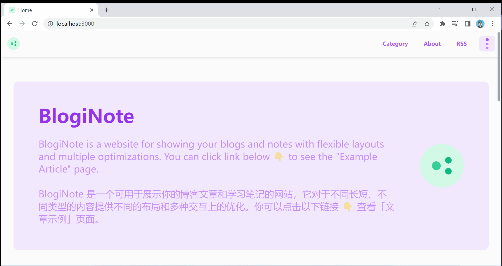
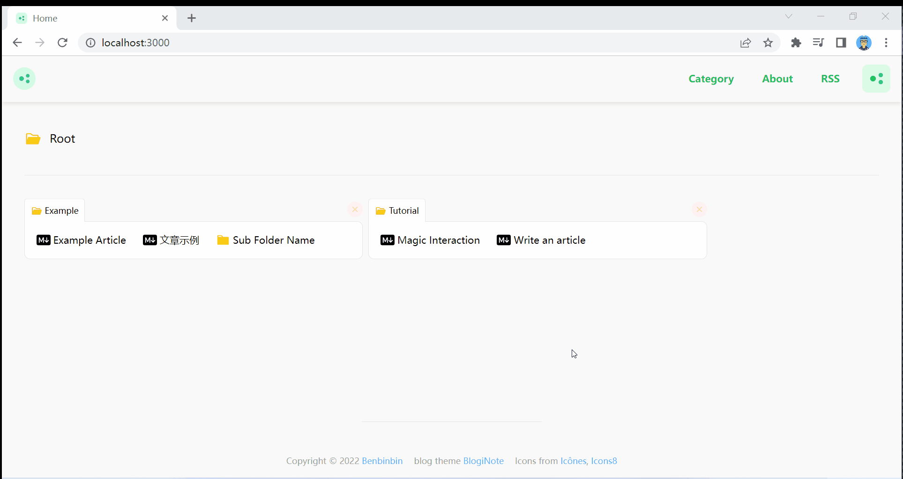

# 神奇的交互

该教程会向你介绍 BlogiNote 中神奇的交互。

## 改变模式

正如其名 **BlogiNote**，它将 [Blog]{.text-purple-400 .font-bold} 和 [Note]{.text-green-400 .font-bold} 通过 Flx[i]{.text-yellow-500 .font-bold}ble 灵活的布局组合在一起。

你仅需要[:IconCustom{name="majesticons:cursor-click"} 点击]{.text-purple-500}一个按钮 :sunglasses: 就可以轻松地将网站在 blog 和 note 这两种模式之间来回**切换**

例如在[首页](/)，如果你将模式切换到 [blog]{.text-purple-400 .font-bold} 模式，页面就会显示文章列表，你可以查看最近更新的文章，就像你平时所浏览的部落格网站一样。

如果你将模式切换到 [note]{.text-green-400 .font-bold} 模式，页面就会基于网格来显示所有的文章，就像你平时在电脑上看到的文件系统一样的层级结构。



在 note 模式下，你可以[:IconCustom{name="majesticons:cursor-click"} 点击]{.text-purple-500}子文件夹进行原地的下钻操作，查看子文件夹里内容



:IconCustom{name="noto:magic-wand"} 很神奇~对吧 :v: 快切换到 node 模式尝试一下吧 :yum:

## 代码块

[:IconCustom{name="majesticons:cursor-click"} 点击]{.text-purple-500}代码块左上角的 :IconCustom{name="material-symbols:keyboard-arrow-down-rounded"} 按钮以**展开或收起** :page_with_curl: 长长的代码块。

[:IconCustom{name="majesticons:cursor-click"} 点击]{.text-purple-500} :IconCustom{name="uil:copy"} 按钮来一键复制代码块

```js
const languageColorMap = {
  theme: '#a855f7',
  bash: '#89e051',
  shell: '#89e051',
  html: '#e34c26',
  javascript: '#f1e05a',
}
```

## 图片


你可以[:IconCustom{name="ic:round-ads-click"} 双击]{.text-purple-500}文章中的图片，然后一个称为 LightBox 的组件就会弹出，它会将图片放大到和屏幕一样大。

你可以和 LightBox 进行多种交互：

* 在图片上[:IconCustom{name="iconoir:mouse-scroll-wheel"} 滚动]{.text-purple-500}鼠标的滚轮，或（在触控屏）[:IconCustom{name="material-symbols:pinch-outline-rounded"} 捏合双指]{.text-purple-500}以缩放图片

* [:IconCustom{name="tabler:arrows-move"} 拖拽]{.text-purple-500}可以将图片四处移动

* 有多个按钮悬浮在图片上，你可以[:IconCustom{name="majesticons:cursor-click"} 单击]{.text-purple-500}图片以显示或隐藏这些按钮

* 如果你想关闭 LightBox，你可以[:IconCustom{name="majesticons:cursor-click"} 点击]{.text-purple-500}模糊的背景，或是[:IconCustom{name="majesticons:cursor-click"} 点击]{.text-purple-500}右上角的 [Esc :IconCustom{name="ic:round-close"}]{.p-1 .text-sm .text-red-500 .bg-red-100 .border .border-red-300 .rounded} 按钮，或是按下键盘上的 `Esc` 键

* 在左上角的紫色按钮 [percent%]{.p-1 .text-sm .text-purple-500 .bg-purple-100 .border .border-purple-300 .rounded} 显示图片当前的缩放比例，你可以[:IconCustom{name="majesticons:cursor-click"} 点击]{.text-purple-500}它，或[:IconCustom{name="ic:round-ads-click"} 双击]{.text-purple-500}图片以重置缩放值（到 100%）和位置（移回居中位置）